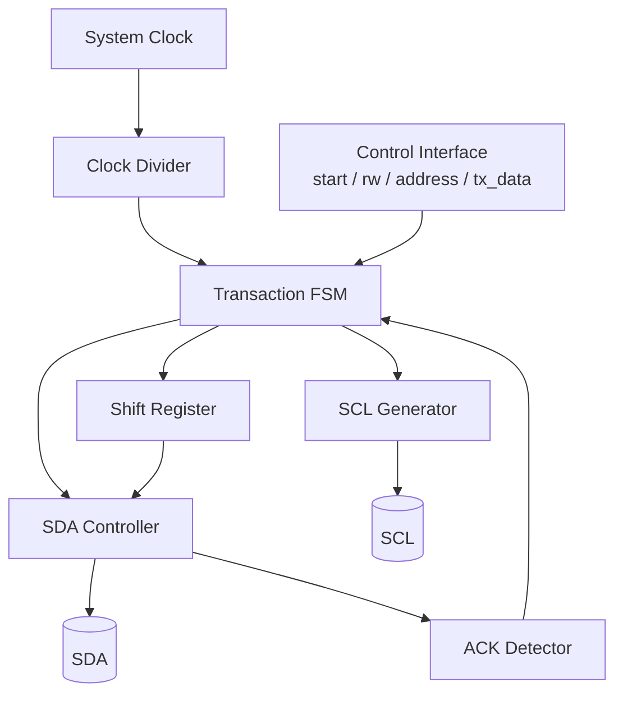
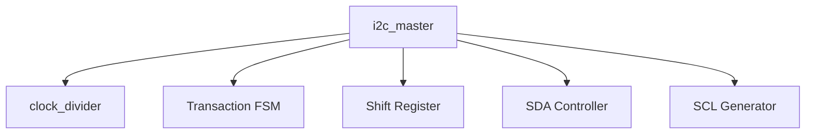

# I2C Master Controller Architecture

## Overview

This project implements a synthesizable **I2C Master Controller** in Verilog.

The design targets FPGA/ASIC implementation and is verified using:

- Icarus Verilog
- GTKWave

---

## Supported Features

- Standard Mode (100 kHz)
- 7-bit Slave Address
- Read Operation
- Write Operation
- START Condition
- STOP Condition
- ACK / NACK Detection
- Configurable Clock Divider
- Parameterized Design

---

# Top-Level Architecture

---

# Module Hierarchy

---

# Internal Blocks

## Clock Divider

Generates timing pulses for the I2C controller.

---

## Transaction FSM

Controls the complete I2C transaction.

Responsibilities:

- START
- STOP
- Address Transmission
- Read
- Write
- ACK Detection
- Transaction Completion

---

## Shift Register

Serializes transmitted data and stores received data.

---

## SDA Controller

Implements the required open-drain output.

---

## SCL Generator

Generates the I2C clock from the timing pulse.

---

# Design Goals

- Fully synthesizable
- Parameterized
- Modular
- Easy to verify
- Interview-friendly RTL