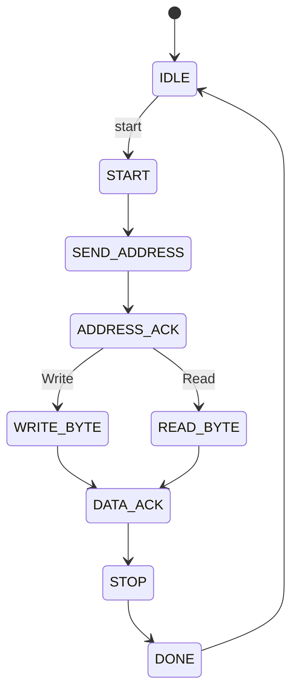
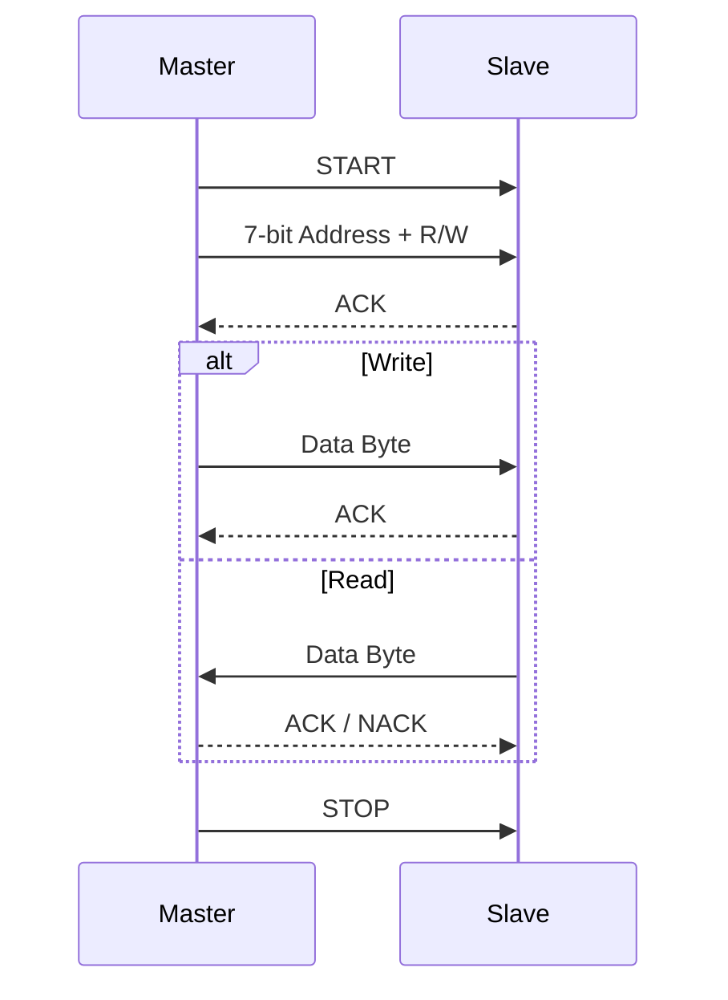

# I2C Master State Machine

## State Diagram

---

## Transaction Flow

---

# State Description

## IDLE

Wait until `start` is asserted.

---

## START

Generate the START condition.

---

## SEND_ADDRESS

Transmit the 7-bit slave address followed by the R/W bit.

---

## ADDRESS_ACK

Sample the ACK bit from the slave.

---

## WRITE_BYTE

Transmit one byte.

---

## READ_BYTE

Receive one byte.

---

## DATA_ACK

Handle the acknowledgment after each transferred byte.

---

## STOP

Generate the STOP condition.

---

## DONE

Assert `done` and return to `IDLE`.